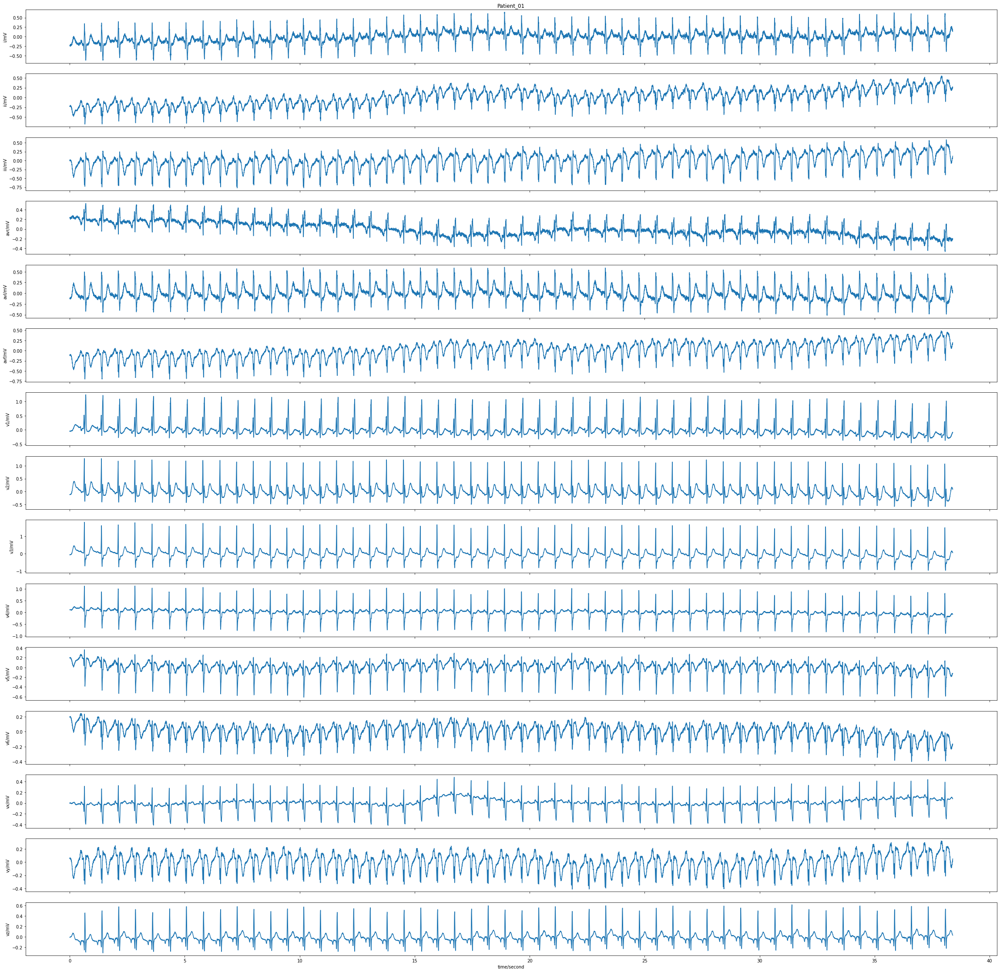
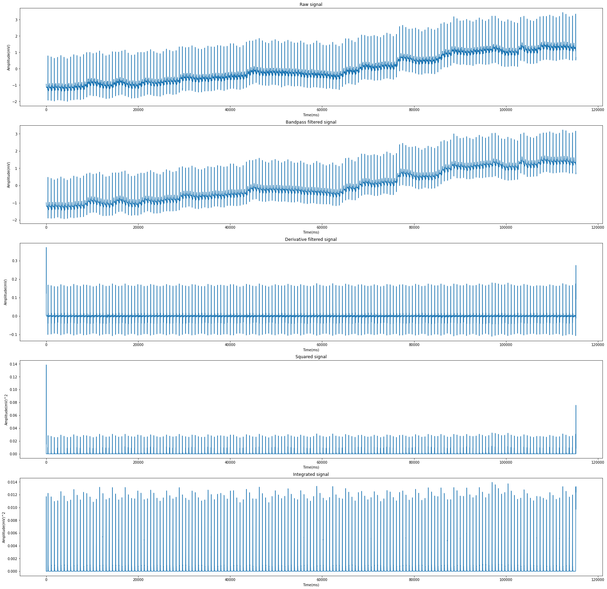
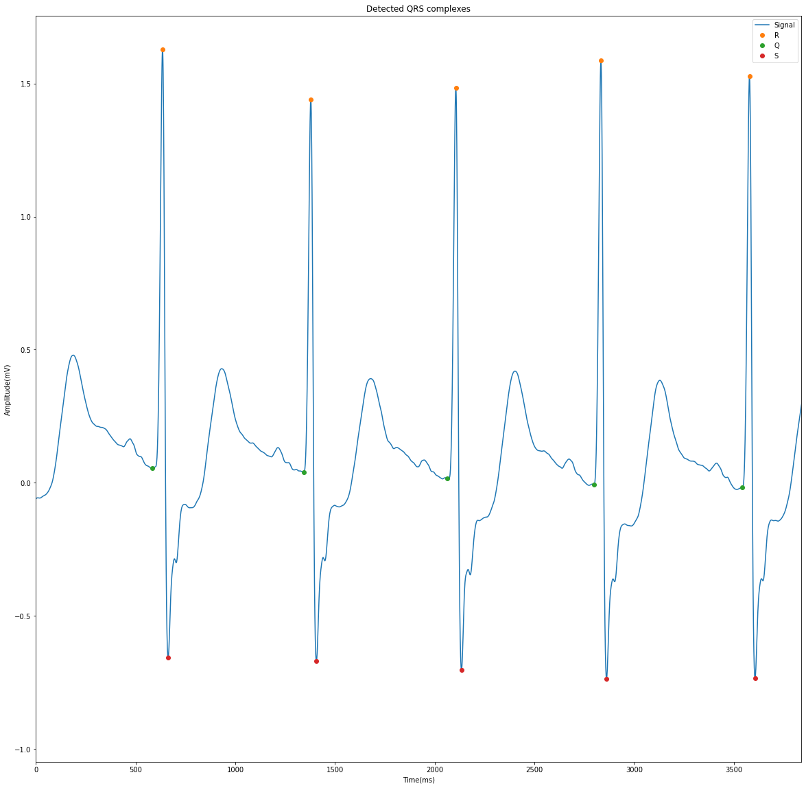
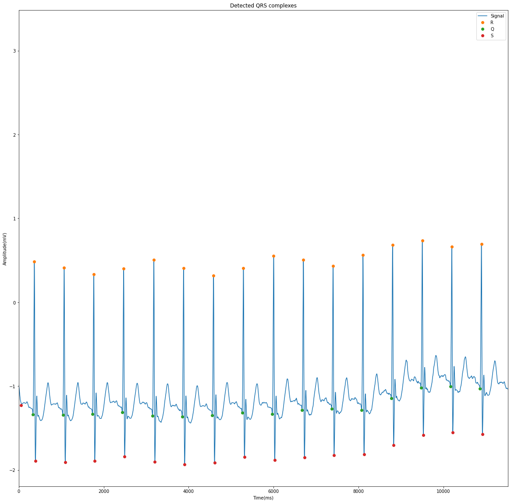
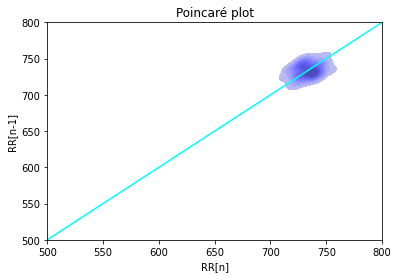
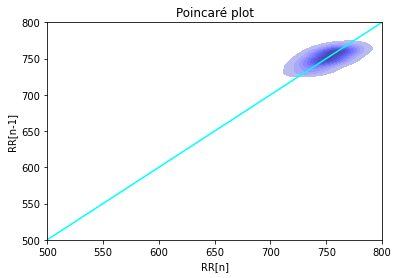

# ECG_analysis

In this repository I've presented a little example on how to work with ECG recordings. In the colab notebook uploaded an example of the code as well as the pipeline followed can be observed. 
I've also uploaded a .html report extracted from the database generated.

The main topics that I've worked in have been:
* Database extraction from the .hea files
* Loading recording with the wtdb package

* Processing recordings sequentally by bandpass filtering, derivative filtering, squaring and integration

* Detection of QRS complexes

* Extracting RR, QR , RS and QRS measurements and poincaré plots

* Report
[click here](DB_analysis.html)
* Future steps

